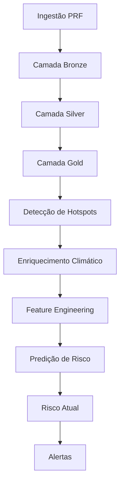

# BR381 Risk Pipeline

[](https://prefect.com)
[](https://www.python.org/)
[](https://www.postgresql.org/)
[](https://docs.docker.com/compose/)
[]()

> Um pipeline de dados orquestrado para transformar registros brutos de acidentes na BR-381 em risco calculado, hotspots identificados e alertas operacionais — do zero, com um único `docker compose up`.

---

## 🌎 Visão geral

O **BR381 Risk Pipeline** é um sistema de orquestração de workflows voltado ao monitoramento de risco de acidentes na rodovia BR-381. Ele automatiza toda a esteira de dados: ingestão, limpeza, enriquecimento climático, geração de features, cálculo de risco e disparo de alertas — tudo coordenado pelo **Prefect 3** e executado de forma reproduzível via **Docker Compose**.

Este projeto foi desenvolvido como trabalho final da disciplina de **Orquestração de Workflow**, com foco em construir algo além de um exercício acadêmico: um pipeline modular, resiliente, idempotente e observável, que se aproxima de um cenário real de engenharia de dados aplicado à segurança viária.

## 🧭 Problema e contexto

A BR-381 é uma rodovia de altíssima relevância logística no Brasil, historicamente marcada por trechos críticos e alta recorrência de ocorrências. O desafio real aqui não é simplesmente armazenar registros de acidentes — é transformar múltiplas fontes de dados heterogêneas em uma esteira automatizada, capaz de gerar sinal analítico útil para monitoramento contínuo e tomada de decisão.

Este projeto ataca esse problema consolidando dados brutos, aplicando tratamento em camadas, enriquecendo registros com contexto climático, calculando indicadores de risco e disponibilizando artefatos analíticos e operacionais prontos para consumo. A escolha por um pipeline orquestrado — em vez de scripts soltos — se justifica porque o fluxo tem dependências claras entre etapas, exige reexecução segura, precisa persistir resultados de forma confiável e demanda visibilidade sobre falhas e execuções.

## 🏗️ Arquitetura da solução

A solução segue o padrão **Medallion (Bronze → Silver → Gold)**, estendido com etapas de enriquecimento, feature engineering, inferência de risco e alertas. Essa arquitetura favorece modularidade, idempotência e separação clara de responsabilidades entre as camadas do pipeline.

### Como o pipeline flui

Cada etapa prepara o terreno para a próxima — nada acontece isoladamente. Essa organização em cadeia facilita manutenção, reforça modularidade e permite reexecutar partes específicas do fluxo sem comprometer o restante, o que é essencial para resiliência e observabilidade.



#### 1. Ingestão PRF
Coleta os dados brutos da fonte principal do projeto — os registros oficiais da Polícia Rodoviária Federal. O objetivo aqui é capturar e persistir os dados de origem com o mínimo de transformação possível, preservando rastreabilidade e viabilizando reprocessamento posterior.

#### 2. Camada Bronze
Primeiro nível de persistência do pipeline. Funciona como zona de aterrissagem, guardando os registros brutos (ou minimamente padronizados) de forma que a origem fique preservada e a auditoria seja simples.

#### 3. Bronze → Silver
Aqui acontece a faxina: limpeza, padronização, tipagem, validação e deduplicação. A base bruta vira uma camada consistente, com ruídos reduzidos e problemas estruturais corrigidos antes de qualquer análise.

#### 4. Camada Silver
Concentra dados já tratados e organizados estruturalmente. Serve como base confiável para enriquecimentos e cruzamentos mais elaborados — o ponto intermediário entre "dado bruto" e "dado pronto para análise".

#### 5. Silver → Gold
Fase de consolidação analítica. A partir dos dados refinados da Silver, o pipeline gera tabelas orientadas ao consumo: indicadores, agregações e entidades que sustentam decisões e etapas de monitoramento.

#### 6. Camada Gold
Camada final de consumo analítico. Aqui ficam os dados prontos para consulta e interpretação — a base que sustenta a detecção de hotspots, o cálculo de risco e a geração de alertas.

#### 7. Detecção de hotspots
Identifica trechos críticos da BR-381 a partir da concentração, recorrência ou intensidade de ocorrências. Transforma histórico consolidado em sinal analítico útil para priorização operacional e leitura espacial do risco.

#### 8. Enriquecimento meteorológico
Adiciona contexto externo aos dados processados, cruzando registros com condições climáticas relevantes. Isso amplia a capacidade analítica do pipeline, incorporando fatores ambientais que influenciam diretamente o risco.

#### 9. Criação de features
Converte dados tratados e enriquecidos em atributos prontos para análise preditiva — as variáveis de entrada que alimentam o cálculo e a predição de risco.

#### 10. Predição de risco histórico
Aplica a lógica analítica (ou modelo) sobre os dados históricos preparados, gerando uma visão estruturada da criticidade observada ao longo do tempo.

#### 11. Risco atual
Consolida a visão operacional mais recente do cenário monitorado, dando suporte a um acompanhamento praticamente em tempo real.

#### 12. Alertas
Etapa final: transforma resultado analítico em ação. Quando limiares configurados são atingidos, o sistema registra e envia notificações, permitindo resposta rápida a condições críticas. 🚨

### Papel da orquestração

O Prefect coordena a ordem de execução de todas essas etapas, garantindo que cada fase só rode quando suas dependências estiverem satisfeitas. Ele também centraliza agendamento, retries, monitoramento e rastreabilidade — o que torna o pipeline confiável mesmo diante de falhas transitórias.

### Componentes principais

| Componente | Papel |
|---|---|
| **Prefect Server** | Interface e backend de orquestração, agendamento e observabilidade |
| **Prefect Worker** | Executa os deployments e flows do projeto |
| **PostgreSQL** | Persiste as camadas Bronze/Silver/Gold, tabelas auxiliares e auditoria |
| **Docker Compose** | Orquestra a stack local de serviços em containers |

## 🛠️ Ferramentas utilizadas

| Ferramenta | Papel no projeto | Justificativa |
|---|---|---|
| **Prefect 3** | Orquestração de workflows | Modela dependências, agendamento, retries e execução observável com UI de monitoramento nativa |
| **PostgreSQL** | Persistência | Centraliza camadas Bronze/Silver/Gold e histórico de execução com armazenamento relacional confiável |
| **Docker Compose** | Execução da stack | Sobe o projeto do zero com um único comando, padronizando serviços, rede e volumes |
| **Python** | Implementação do pipeline | Linguagem principal para flows, ETL, integração com APIs e regras de negócio |
| **scikit-learn / joblib** | Predição e serialização | Suporte ao uso e persistência do modelo de risco em ambiente operacional |
| **Open-Meteo** | Enriquecimento externo | Fornece os dados meteorológicos usados na etapa de enrichment |
| **Telegram** | Notificação | Canal simples e direto para alertas operacionais baseados em limiares |

## 📂 Estrutura do repositório

```text
.
├── docker-compose.yml
├── Dockerfile
├── prefect.yaml
├── requirements.txt
├── sql/
├── models/
├── logs/
├── data/
├── src/
│   ├── alerts/
│   ├── config/
│   ├── database/
│   ├── flows/
│   ├── ingestion/
│   ├── ml/
│   ├── transformations/
│   └── weather/
└── README.md
```

| Pasta | Conteúdo |
|---|---|
| `src/flows/` | Definição dos flows orquestrados no Prefect |
| `src/database/` | Inicialização do banco, repositórios e persistência |
| `src/config/` | Configuração e variáveis do projeto |
| `src/transformations/` | Regras de transformação entre camadas |
| `src/weather/` | Enriquecimento meteorológico |
| `src/ml/` | Criação de features e inferência de risco |
| `sql/` | Criação e manutenção de schemas e tabelas |
| `models/` | Artefatos de modelo serializados |
| `logs/` | Registros auxiliares de execução |

## 🚀 Como executar o projeto do zero

Esta seção foi pensada para que qualquer avaliador consiga subir o projeto diretamente do repositório, sem passos escondidos.

### Pré-requisitos

- Docker instalado
- Docker Compose disponível

### 1. Clonar o repositório

```bash
git clone https://github.com/seu-usuario/br381-risk-pipeline.git
cd br381-risk-pipeline
```

### 2. Subir a stack

```bash
docker compose up -d
```

Esse comando sobe PostgreSQL, Prefect Server e Prefect Worker em containers isolados, conectados pela mesma rede Compose. Na primeira subida, o worker também inicializa o banco e registra os deployments automaticamente.

### 3. Verificar se os containers estão ativos

```bash
docker compose ps
```


### 4. Acompanhar logs

```bash
docker compose logs -f prefect-server
docker compose logs -f prefect-worker
docker compose logs -f postgres
```

### 5. Acessar a interface do Prefect

```text
http://localhost:4200
```


### 6. Validar se os deployments foram registrados

```bash
docker exec -e PREFECT_API_URL=http://prefect-server:4200/api -it br381-prefect-worker prefect deployment ls
```


### 7. Executar um deployment manualmente

```bash
docker exec -e PREFECT_API_URL=http://prefect-server:4200/api -it br381-prefect-worker prefect deployment run "br381-full-pipeline/br381-daily"
```

ou

```bash
docker exec -e PREFECT_API_URL=http://prefect-server:4200/api -it br381-prefect-worker prefect deployment run "current-monitoring/br381-monitoring"
```


### 8. Consultar tabelas no PostgreSQL

Inspecionar uma tabela:

```bash
docker exec -it br381-postgres psql -U br381 -d br381 -c "\d+ silver.weather_cache"
```

Contar registros:

```bash
docker exec -it br381-postgres psql -U br381 -d br381 -c "SELECT COUNT(*) AS total_rows FROM silver.weather_cache;"
```


## ⏱️ Deployments do Prefect

| Deployment | Entrypoint | Frequência |
|---|---|---|
| `br381-daily` | `src/flows/pipeline_flow.py:br381_pipeline` | diariamente às 06:00 (`America/Sao_Paulo`) |
| `br381-monitoring` | `src/flows/current_monitoring_flow.py:current_monitoring` | a cada hora (`America/Sao_Paulo`) |

Esses deployments implementam o requisito de **agendamento/trigger** do trabalho, permitindo tanto execução automática via cron quanto disparo manual via CLI ou UI do Prefect.

## ⚙️ Configurações customizáveis

O pipeline expõe um conjunto de parâmetros de negócio como **Prefect Variables**, o que permite ajustar o comportamento do sistema de risco e alertas **sem precisar alterar código ou fazer novo deploy**. Essas variáveis ficam centralizadas em `src/config/risk_config.py` e podem ser lidas e sobrescritas diretamente pela UI do Prefect (`Variables`) ou via CLI.

```python
from prefect.variables import Variable


def get_high_risk_threshold():
    return float(Variable.get("high_risk_threshold", default=0.35))


def get_medium_risk_threshold():
    return float(Variable.get("medium_risk_threshold", default=0.15))


def get_telegram_alert_threshold():
    return float(Variable.get("telegram_alert_threshold", default=0.60))


def get_telegram_alert_enabled():
    value = Variable.get("telegram_alert_enabled", default=True)
    return bool(value)


def get_hotspots_limit():
    value = Variable.get("hotspots_limit", default=10)
    return int(value)
```

| Variável | Default | Papel |
|---|---|---|
| `high_risk_threshold` | `0.35` | Limiar acima do qual um trecho é classificado como **alto risco** |
| `medium_risk_threshold` | `0.15` | Limiar acima do qual um trecho é classificado como **risco médio** |
| `telegram_alert_threshold` | `0.60` | Limiar mínimo de risco para disparar um **alerta no Telegram** |
| `telegram_alert_enabled` | `True` | Liga/desliga o envio de alertas via Telegram, sem tocar em código |
| `hotspots_limit` | `10` | Quantidade máxima de hotspots retornados na etapa de detecção |

Como essas configurações usam `Variable.get(..., default=...)`, o pipeline sempre tem um valor de fallback seguro mesmo se a variável nunca tiver sido criada — mas basta ajustar o valor na UI do Prefect para o próximo run já refletir a mudança, sem redeploy. 🔧


## ✅ Requisitos mínimos atendidos

| Requisito | Como o projeto atende |
|---|---|
| Agendamento ou trigger | Deployments agendados no Prefect + execução manual disponível |
| Resiliência | Flows com retries e tratamento explícito de falhas |
| Idempotência | Upsert, deduplicação e reexecução segura das camadas |
| Modularidade | Código organizado em flows, transformação, banco, clima, ML e alertas |
| Persistência | Dados e metadados gravados no PostgreSQL |
| Observabilidade | Prefect UI, logs de containers e tabelas de auditoria |

## 🧠 Decisões técnicas relevantes

### Por que Prefect e não Airflow

O Prefect foi escolhido por oferecer uma experiência Python-first mais simples para modelar flows, com boa observabilidade local, suporte nativo a retries, deployments e execução distribuída via worker. Para este projeto, isso reduziu a complexidade operacional sem abrir mão dos requisitos centrais da disciplina.

### Por que arquitetura Bronze → Silver → Gold

A separação em camadas melhora rastreabilidade, organização e reprocessamento seguro. Dados brutos ficam preservados na Bronze, a limpeza e padronização se concentram na Silver, e os dados prontos para consumo analítico vão para a Gold — reforçando idempotência e modularidade em cada etapa.

### Estratégia de idempotência

O pipeline foi estruturado para suportar reexecução sem gerar duplicidade indevida. Isso é essencial porque o projeto exige que o pipeline possa ser rerodado com segurança, especialmente em cenários de agendamento periódico e falhas transitórias.

### Por que Docker Compose

O Docker Compose tornou o ambiente reproduzível e simples de iniciar com um único `docker compose up`, exatamente como pedido no trabalho. Ele também padroniza serviços, redes, volumes e o startup completo da stack local — sem depender de configuração manual.

## 📊 Evidências de funcionamento

Para comprovar que o pipeline está funcional, é possível verificar:

- status dos containers com `docker compose ps`;
- deployments e runs visíveis no Prefect UI;
- logs do worker e do server sem erros de módulo ou conexão;
- tabelas Bronze/Silver/Gold alimentadas no PostgreSQL;
- execução manual de deployments com acompanhamento do estado dos runs em tempo real;
- alerta recebido no Telegram quando o risco ultrapassa o threshold configurado.


Esses pontos sustentam tanto a avaliação de "pipeline funcionando" quanto a demonstração no pitch em vídeo.

## 🎬 Pitch em vídeo

https://www.youtube.com/watch?v=FdgF0kawJqY

## 🏁 Conclusão

O **BR381 Risk Pipeline** foi estruturado para atender aos objetivos técnicos e avaliativos do trabalho final de Orquestração de Workflow, combinando orquestração com Prefect, persistência em PostgreSQL, execução dockerizada e uma arquitetura de dados em camadas. O projeto equilibra escopo realista, clareza arquitetural e capacidade de execução reproduzível — do clone ao pipeline rodando, em poucos comandos.
