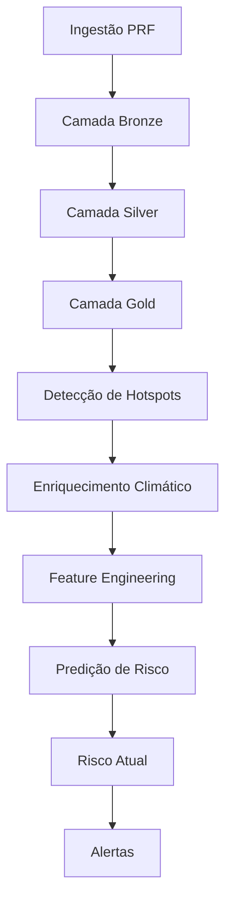

# BR381 Risk Pipeline

[](https://prefect.com)
[](https://docs.docker.com/compose/)

## Visão geral

**BR381 Risk Pipeline** é um projeto de orquestração de workflows para monitoramento de risco de acidentes na rodovia BR-381. O pipeline automatiza ingestão, transformação, enriquecimento com dados meteorológicos, geração de features, cálculo de risco e envio de alertas, utilizando **Prefect 3** como orquestrador e **Docker Compose** para execução reproduzível do ambiente.[cite:1][cite:2]

O projeto foi desenvolvido como trabalho final da disciplina de **Orquestração de Workflow**, com foco em um pipeline realista, modular, resiliente, idempotente e observável, próximo de um cenário profissional de dados e monitoramento operacional.[cite:1][cite:2]

## Problema e contexto

A BR-381 é uma rodovia de alta relevância logística e historicamente associada a ocorrências rodoviárias e trechos críticos. Nesse contexto, o desafio não é apenas armazenar dados de acidentes, mas transformar múltiplas fontes em uma esteira automatizada capaz de produzir informação útil para análise e monitoramento contínuo.[cite:1][cite:2]

Este projeto resolve esse problema ao consolidar dados brutos, aplicar tratamento em camadas, enriquecer registros com clima, calcular indicadores e disponibilizar artefatos analíticos e operacionais. A escolha por um pipeline orquestrado é adequada porque o fluxo possui dependências entre etapas, necessidade de reexecução segura, persistência de resultados e acompanhamento de falhas e execuções.[cite:1][cite:2]

## Arquitetura da solução

A solução adota uma arquitetura inspirada no padrão **Medallion (Bronze → Silver → Gold)**, complementada por etapas de enriquecimento, feature engineering, inferência de risco e alertas. Esse padrão está alinhado às sugestões do trabalho e facilita modularidade, idempotência e separação de responsabilidades entre as camadas do pipeline.[cite:1][cite:2]

### Etapas do pipeline

1. **Ingestão PRF** — coleta e carga dos dados brutos.
2. **Bronze → Silver** — limpeza, tipagem, padronização e deduplicação.
3. **Silver → Gold** — consolidação analítica.
4. **Detecção de hotspots** — identificação de trechos críticos.
5. **Enriquecimento meteorológico** — associação com condições de clima.
6. **Criação de features** — preparação para análise/predição.
7. **Predição de risco histórico** — cálculo de risco sobre base tratada.
8. **Risco atual** — visão operacional mais recente.
9. **Alertas** — notificação com base em limiares configurados.



### Componentes principais

- **Prefect Server**: interface e backend de orquestração, agendamento e observabilidade.[cite:1]
- **Prefect Worker**: execução dos deployments e flows do projeto.[cite:1]
- **PostgreSQL**: persistência das camadas de dados, tabelas auxiliares e auditoria.[cite:1]
- **Docker Compose**: orquestração da stack local de serviços em containers.[cite:3]

## Ferramentas utilizadas

| Ferramenta | Papel no projeto | Justificativa |
|---|---|---|
| Prefect 3 | Orquestração de workflows | Permite modelar dependências, agendamento, retries, execução observável e UI de monitoramento, atendendo diretamente aos requisitos da disciplina.[cite:1][cite:2] |
| PostgreSQL | Persistência | Centraliza camadas Bronze/Silver/Gold, tabelas de apoio e histórico de execução com armazenamento relacional confiável.[cite:1] |
| Docker Compose | Execução da stack | Permite subir o projeto do zero com um único comando, padronizando serviços, rede e volumes do ambiente.[cite:3][cite:1] |
| Python | Implementação do pipeline | Linguagem principal para flows, ETL, integração com APIs, features e lógica de negócio. |
| scikit-learn / joblib | Predição e serialização | Suporte ao uso e persistência de modelo de risco em ambiente operacional. |
| Open-Meteo | Enriquecimento externo | Fornece dados meteorológicos usados na etapa de enrichment. |
| Telegram | Notificação | Canal simples para alertas operacionais baseados em limiares. |

## Estrutura do repositório

```text
.
├── docker-compose.yml
├── Dockerfile
├── prefect.yaml
├── requirements.txt
├── sql/
├── models/
├── logs/
├── data/
├── src/
│   ├── alerts/
│   ├── config/
│   ├── database/
│   ├── flows/
│   ├── ingestion/
│   ├── ml/
│   ├── transformations/
│   └── weather/
└── README.md
```

### Pastas principais

- `src/flows/` — definição dos flows orquestrados no Prefect.
- `src/database/` — inicialização do banco, repositórios e persistência.
- `src/config/` — configuração e variáveis do Prefect.
- `src/transformations/` — regras de transformação entre camadas.
- `src/weather/` — enriquecimento meteorológico.
- `src/ml/` — criação de features e inferência de risco.
- `sql/` — criação e manutenção de schemas e tabelas.
- `models/` — artefatos de modelo.
- `logs/` — registros auxiliares de execução.

## Como executar o projeto do zero

Esta seção foi pensada para permitir que o avaliador suba o projeto diretamente do repositório, como solicitado no trabalho.[cite:1][cite:2][cite:3]

### Pré-requisitos

- Docker instalado
- Docker Compose disponível

### 1. Clonar o repositório

```bash
git clone https://github.com/seu-usuario/br381-risk-pipeline.git
cd br381-risk-pipeline
```

### 2. Subir a stack

```bash
docker compose up -d
```

Esse comando sobe os serviços principais do projeto, incluindo PostgreSQL, Prefect Server e Prefect Worker, em containers isolados e conectados pela mesma rede Compose.[cite:3]

### 3. Verificar se os containers estão ativos

```bash
docker compose ps
```

### 4. Acompanhar logs

```bash
docker compose logs -f prefect-server
docker compose logs -f prefect-worker
docker compose logs -f postgres
```

### 5. Acessar a interface do Prefect

Abra no navegador:

```text
http://localhost:4200
```

### 6. Validar se os deployments foram registrados

```bash
docker exec -e PREFECT_API_URL=http://prefect-server:4200/api -it br381-prefect-worker prefect deployment ls
```

### 7. Executar um deployment manualmente

```bash
docker exec -e PREFECT_API_URL=http://prefect-server:4200/api -it br381-prefect-worker prefect deployment run "br381-full-pipeline/br381-daily"
```

ou

```bash
docker exec -e PREFECT_API_URL=http://prefect-server:4200/api -it br381-prefect-worker prefect deployment run "current-monitoring/br381-monitoring"
```

### 8. Consultar tabelas no PostgreSQL

Exemplo para inspecionar uma tabela:

```bash
docker exec -it br381-postgres psql -U br381 -d br381 -c "\d+ silver.weather_cache"
```

Exemplo para contar registros:

```bash
docker exec -it br381-postgres psql -U br381 -d br381 -c "SELECT COUNT(*) AS total_rows FROM silver.weather_cache;"
```

## Deployments do Prefect

O projeto define dois deployments principais no `prefect.yaml`:

| Deployment | Entrypoint | Frequência |
|---|---|---|
| `br381-daily` | `src/flows/pipeline_flow.py:br381_pipeline` | diariamente às 06:00 (`America/Sao_Paulo`) |
| `br381-monitoring` | `src/flows/current_monitoring_flow.py:current_monitoring` | a cada hora (`America/Sao_Paulo`) |

Esses deployments implementam o requisito de **agendamento/trigger** exigido no trabalho, permitindo tanto execução automática quanto disparo manual via CLI ou UI do Prefect.[cite:1][cite:2]

## Requisitos mínimos atendidos

Esta seção conecta explicitamente o projeto aos requisitos mínimos definidos no enunciado.[cite:1][cite:2]

| Requisito | Como o projeto atende |
|---|---|
| Agendamento ou trigger | Deployments agendados no Prefect e possibilidade de execução manual |
| Resiliência | Flows com retries e tratamento explícito de falhas |
| Idempotência | Estratégias de upsert, deduplicação e reexecução segura das camadas |
| Modularidade | Código organizado em flows, módulos de transformação, banco, clima, ML e alertas |
| Persistência | Dados e metadados gravados no PostgreSQL |
| Observabilidade | Prefect UI, logs de containers e tabelas de auditoria |

## Decisões técnicas relevantes

### Por que Prefect e não Airflow

Prefect foi escolhido por oferecer uma experiência mais simples para modelagem de flows Python-first, com boa observabilidade local, suporte nativo a retries, deployments e execução distribuída com worker. Para este projeto, isso reduziu a complexidade operacional sem abrir mão dos requisitos centrais da disciplina.[cite:1][cite:2]

### Por que arquitetura Bronze → Silver → Gold

A separação em camadas melhora rastreabilidade, organização e reprocessamento seguro. Dados brutos são preservados na Bronze, limpeza e padronização ficam concentradas na Silver, e os dados prontos para consumo analítico vão para a Gold, o que reforça idempotência e modularidade.[cite:1][cite:2]

### Estratégia de idempotência

O pipeline foi estruturado para suportar reexecução sem gerar duplicidade indevida. Isso é importante porque o trabalho exige que o pipeline possa ser rerodado de maneira segura, especialmente em cenários com agendamento periódico e falhas transitórias.[cite:1][cite:2]

### Por que Docker Compose

Docker Compose foi adotado para tornar o ambiente reproduzível e simples de iniciar com `docker compose up`, exatamente como solicitado no trabalho. Além disso, ele facilita a padronização entre serviços, redes, volumes e startup da stack local.[cite:1][cite:3]

## Evidências de funcionamento

Para demonstrar que o pipeline está funcional, podem ser verificadas as seguintes evidências:

- status dos containers com `docker compose ps`;
- deployments e runs visíveis no Prefect UI;
- logs do worker e do server;
- tabelas alimentadas no PostgreSQL;
- execução manual de deployments e acompanhamento do estado dos runs.

Esses pontos ajudam a sustentar tanto a avaliação de pipeline funcionando quanto a demonstração no pitch em vídeo.[cite:1][cite:2]

## Pitch em vídeo

O enunciado exige um pitch de 5 a 10 minutos com demonstração do projeto rodando, arquitetura e decisões técnicas.[cite:1][cite:2]

O vídeo deve mostrar, no mínimo:

- o problema resolvido pelo pipeline;
- a arquitetura escolhida;
- uma execução real do pipeline;
- a interface do Prefect acompanhando os runs;
- as principais decisões técnicas adotadas.

### Link do vídeo

> Adicionar aqui o link do pitch e as instruções de acesso.

## Conclusão

O **BR381 Risk Pipeline** foi estruturado para atender aos objetivos técnicos e avaliativos do trabalho final de Orquestração de Workflow, combinando orquestração com Prefect, persistência em PostgreSQL, execução dockerizada e uma arquitetura de dados em camadas. O projeto busca equilibrar escopo realista, clareza arquitetural e capacidade de execução reproduzível a partir do repositório.[cite:1][cite:2][cite:3]