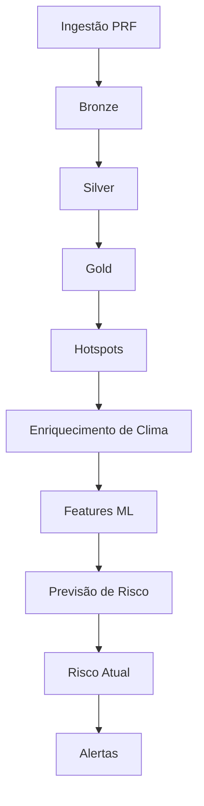

# BR381 Risk Pipeline

[](https://prefect.com) [](https://docs.docker.com/compose/)

## 1. Título e resumo

**BR381 Risk Pipeline** é um projeto de orquestração de workflows que automatiza a ingestão, transformação, enriquecimento, geração de features, cálculo de risco e envio de alertas para o contexto da rodovia BR-381. A solução é implementada com **Prefect 3** e executada via **Docker Compose**, garantindo execução reproduzível e visibilidade das etapas.

## 2. Problema que o pipeline resolve

O projeto resolve o desafio de monitorar ocorrências e risco de acidentes na BR-381 ao centralizar dados de transporte rodoviário e condições meteorológicas. Um pipeline orquestrado faz sentido porque o processo envolve várias etapas sequenciais e dependentes: ingestão de dados brutos, limpeza, enriquecimento, modelagem e alertas. O objetivo é automatizar esses passos de forma resiliente, auditável e com execução controlada.

## 3. Arquitetura da solução

A arquitetura do pipeline é construída em camadas de dados e etapas de processamento:

- ingestão de dados da PRF
- bronze → silver
- silver → gold
- detecção de hotspots
- enriquecimento com clima
- criação de features para ML
- previsão de risco histórico
- risco atual
- alertas

O Prefect orquestra a execução das etapas e trata retries, dependências e visibilidade. O PostgreSQL é responsável pela persistência das tabelas de camada, do histórico de execução e das alertas. O `Docker Compose` roda os serviços necessários em containers isolados.



## 4. Ferramentas utilizadas

- **Prefect 3**: orquestração de workflows, observabilidade e agendamento.
- **PostgreSQL**: armazenamento relacional das camadas ETL, resultados e histórico.
- **Docker / Docker Compose**: execução containerizada e reproduzível do ambiente.
- **Python**: linguagem principal da aplicação.
- **Joblib / scikit-learn**: serialização e inferência do modelo de risco.
- **Open-Meteo**: API para enriquecimento meteorológico.
- **Telegram**: canal de alerta configurável.

## 5. Estrutura do projeto

- `src/`
  - `alerts/` — lógica de alertas e proteção contra spam
  - `config/` — inicialização e variáveis do Prefect
  - `database/` — conexão, repositórios e inicialização do banco
  - `flows/` — definições de fluxos Prefect
  - `ingestion/` — carregamento de dados PRF
  - `ml/` — modelagem e predição de risco
  - `transformations/` — lógica de ETL entre bronze/silver/gold
  - `weather/` — integração com API meteorológica
- `data/raw/` — arquivos de dados brutos
- `models/` — artefatos de modelo treinado
- `sql/` — scripts de criação de tabelas e schemas
- `logs/` — registros de execução
- `docker-compose.yml` — orquestração dos containers
- `prefect.yaml` — deployment definitions do Prefect
- `requirements.txt` — dependências Python

## 6. Como executar o projeto

### Requisitos

- Docker
- Docker Compose
- Python 3.14 (para ambiente local, se necessário)

### Passo a passo

1. Clone o repositório:
   ```bash
   git clone https://github.com/seu-usuario/br381-risk-pipeline.git
   cd br381-risk-pipeline
   ```

2. Suba os containers em segundo plano:
   ```bash
   docker compose up -d
   ```

3. Verifique o status dos serviços:
   ```bash
   docker compose ps
   ```

4. Acompanhe os logs do Prefect e do worker:
   ```bash
   docker compose logs -f prefect-server
   docker compose logs -f prefect-worker
   ```

5. Acesse a interface do Prefect:
   - `http://localhost:4200`

6. Valide os deployments registrados:
   ```bash
   docker compose exec prefect-worker prefect deployment ls
   ```

7. Execute um deployment manualmente:
   ```bash
   docker compose exec prefect-worker prefect deployment run br381-risk-pipeline/br381-daily
   docker compose exec prefect-worker prefect deployment run br381-risk-pipeline/br381-monitoring
   ```

8. Se necessário, inicialize o banco diretamente:
   ```bash
   docker compose exec prefect-worker python3 -m src.database.init_db
   ```

## 7. Deployments do Prefect

O projeto define os seguintes deployments no `prefect.yaml`:

- `br381-daily`
  - entrypoint: `src/flows/pipeline_flow.py:br381_pipeline`
  - agendamento: `0 6 * * *` (06:00, America/Sao_Paulo)
- `br381-monitoring`
  - entrypoint: `src/flows/current_monitoring_flow.py:current_monitoring`
  - agendamento: `0 * * * *` (a cada hora, America/Sao_Paulo)

Os deploys são registrados automaticamente quando o worker executa `prefect deploy --all`.

## 8. Decisões técnicas

- **Prefect 3** foi escolhido para fornecer orquestração, retries e monitoramento de execução.
- **Idempotência** é suportada pela criação controlada de tabelas e atualizações `ON CONFLICT`, reduzindo efeitos colaterais em reexecuções.
- **Persistência** é garantida pelo PostgreSQL para as camadas de dados e logs de execução.
- **Observabilidade** ocorre via Prefect UI, logs de container e tabelas de auditoria como `metadata.pipeline_runs`.
- **Dockerização** torna a implantação previsível e facilita a reprodução do ambiente em diferentes máquinas.
- **Variáveis Prefect** são inicializadas em `src/config/init_variables.py` para thresholds e parâmetros de alerta.

## 9. Evidências de funcionamento

Para verificar que o pipeline está rodando corretamente:

- confira containers com `docker compose ps`
- veja os logs dos serviços Prefect e do worker
- acesse o Prefect UI em `http://localhost:4200`
- confirme tabelas no PostgreSQL como `metadata.pipeline_runs`, `gold.current_hotspots`, `gold.alert_history`
- valide execução manual dos deployments e resultados nos runs

## 10. Pitch em vídeo

O vídeo de apresentação deve incluir:

- definição do problema e do contexto da BR-381
- explicação da arquitetura do pipeline
- demonstração de execução do pipeline em Docker Compose
- evidências do Prefect UI e resultados de runs
- principais decisões técnicas adotadas

Adicione o link do vídeo e instruções de acesso à documentação do projeto.

## 11. Conformidade com o trabalho

O projeto atende aos requisitos do trabalho final de Orquestração de Workflow ao incluir:

- orquestração com Prefect
- agendamento e deploys de workflows
- resiliência com retries e tratamento de falhas
- idempotência de etapas de ETL
- modularidade entre camadas e componentes
- persistência em PostgreSQL
- observabilidade via logs e UI Prefect
- dockerização com Docker Compose
